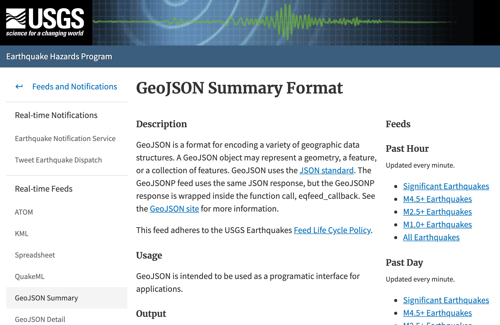
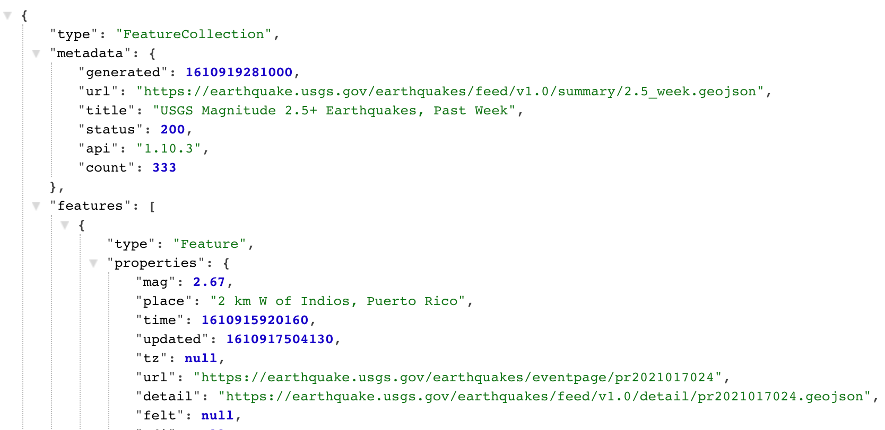

# Leaflet Homework - Visualizing Data with Leaflet

## Background

The United States Geological Survey (USGS) is responsible for providing scientific data about natural hazards, the health of our ecosystems and environment; and the impacts of climate and land-use change. Their scientists develop new methods and tools to supply timely, relevant, and useful information about the Earth and its processes. 

The USGS is interested in building a new set of tools that will allow them visualize their earthquake data. They collect a massive amount of data from all over the world each day, but they lack a meaningful way of displaying it. Their hope is that being able to visualize their data will allow them to better educate the public and other government organizations (and hopefully secure more funding..) on issues facing our planet.

This map utilizes the [Leaflet open-source JavaScriptlibrary](https://leafletjs.com/), html, JavaScript, and CSS.

### Level 1: Basic Visualization

1. **Data**

   

   The USGS provides earthquake data in a number of different formats, updated every 5 minutes. The [USGS GeoJSON Feed](http://earthquake.usgs.gov/earthquakes/feed/v1.0/geojson.php) was used to select a dataset.

   [Dataset Selected: Past 7 Days, M2.5+ Earthquakes (updated every minute)](https://earthquake.usgs.gov/earthquakes/feed/v1.0/summary/2.5_week.geojson)

    

2. **Map Visualization of the Data**

   A map was created using Leaflet that plots all of the earthquakes from the above mentioned data set based on their longitude and latitude.

   * The data markers reflects: 
        * The magnitude of the earthquake by their size 
        * The depth of the earthquake by color
        * Earthquakes with higher magnitudes appear larger and earthquakes with greater depth appear darker in color.

   * Popups that provide additional information about the earthquake when a marker is clicked:
        * Specific Location and time

   * Create a legend that will provide context for your map data.

- - -

### Level 2: More Data (Optional)

The USGS wants you to plot a second data set on your map to illustrate the relationship between tectonic plates and seismic activity. You will need to pull in a second data set and visualize it along side your original set of data. Data on tectonic plates can be found at <https://github.com/fraxen/tectonicplates>.

Additional Layer: Plate Tectonics

* Plot a second data set on our map.

* Add a number of base maps to choose from as well as separate out our two different data sets into overlays that can be turned on and off independently.

* Add layer controls to our map.

- - -